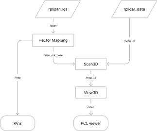
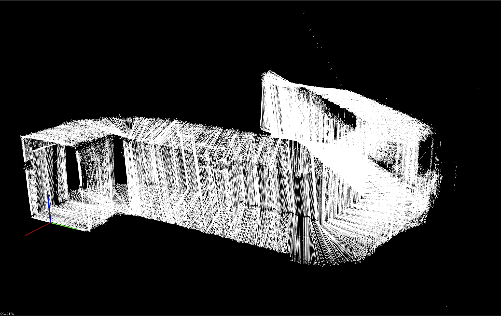

# Indoor 3D Scanning based on two 2D LiDAR sensor and SLAM

### Requirments
* rplidar a series
* [Hector SLAM package](https://github.com/tu-darmstadt-ros-pkg/hector_slam.git)
* [rplidar ROS package](https://github.com/Slamtec/rplidar_ros.git)
~~~
Tested on Ubuntu 20.04LTS, ROS noetic, rplidar a3(a2)
~~~
-----

### Node, Topic diagram

-----

### Result
* captured point cloud(full pcd file at [floot_half.pcd](https://github.com/ross1573/scan_3d/blob/master/demo/floor_half.pcd.zip))

<video width="430px" height="270" controls>
  <source src="./demo/demo_capture.mp4" type="video/mp4">
</video>
  
-----
